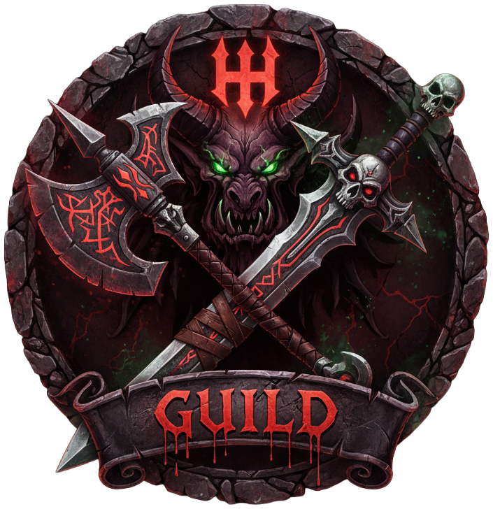

# My Personal Warcraft

A modern World of Warcraft companion application featuring guild roster management, character tracking, mount collection browsing, live event calendar, YouTube video curation, personal todos, M+ leaderboard and comp stat tracking, and a stunning background gallery. Built with vanilla JavaScript and the Battle.net API.

## 📸 Screenshots

<div align="center">
  
</div>

<p align="center">
  
  
</p>

<p align="center">
  
  
</p>

<p align="center">
  
  
</p>

<p align="center">
  
  
</p>

<p align="center">
  
</p>

## ✨ Features

### 🔐 Battle.net Authentication
- OAuth 2.0 integration with popup-based login
- Secure token management with automatic refresh
- Protected routes for personalized features

### 👥 Guild Roster
- Real-time guild data from Battle.net API
- **Cross-realm support** - displays characters from multiple connected realms
- Character cards with Battle.net portrait renders
- Class-colored styling throughout
- Detailed character information:
  - Class, race (gender-specific icons), specialization, faction
  - Item level and equipment stats
  - Realm badges
- Advanced filtering and sorting:
  - Search by name or class
  - Sort by item level, rank, name, level, or class
  - Custom dropdown components with counts
- **Character Modal** - Click any character for detailed view:
  - Full equipment display with quality-colored borders
  - Item icons with hover tooltips
  - Character stats and specialization
  - Interactive modal with backdrop blur

### 🎬 YouTube Video Manager (Auth Required)
- Curate favorite Warcraft YouTube channels
- Automatic video fetching from YouTube Data API v3
- Filter videos by custom search tags
- **Video Modal** - Click any video to watch in-app:
  - Centered modal player (16:9 aspect ratio)
  - Auto-play with easy close
  - Stops video on modal close
- Horizontal scrolling video rows per channel
- Edit channels and manage tags
- Auto-cleanup of videos older than 30 days
- Backend database persistence with cross-device sync

### ✅ Personal Todos (Auth Required)
- Personal task management with backend database persistence
- Auto-fill metadata from URLs (title, description, images)
- Masonry grid layout for dynamic card heights
- Edit, complete, and organize tasks
- Image previews from Open Graph metadata
- Per-user data synced across devices

### 🎨 Background Gallery
- Curated collection of high-quality Warcraft screenshots
- Automatic rotation every 8 seconds with smooth fade transitions
- Location names with attribution
- Download functionality for each background

### 👤 My Characters (Auth Required)
- View all your WoW characters across realms
- Guild rank display for guild members
- Same advanced filtering as guild roster
- Quick access to character details

### 🐎 My Mounts (Auth Required) **NEW!**
- Browse your personal mount collection
- **Tab-Based UI** - Navigate by expansion with smooth scrolling arrows
- **Wowhead Integration** - Icons link directly to Wowhead pages with tooltips on hover
- **High-Quality Icons** - Automatically upgraded from .gif to .jpg for crisp display
- **Spell ID Mapping** - Automated scraper builds accurate mount→spell ID database
- Organized by expansion (Classic through The War Within)
- Only displays mounts you own (matched against database of 1,481 cataloged mounts)
- Static database generation (no repeated API calls)

### 🏆 Mythic+ Leaderboards
- Real-time Mythic+ leaderboard data from Battle.net API
- **Meta Composition Showcase** - Visual display of top performing specs:
  - Top tank, healer, and 3 DPS specializations
  - Percentage-based popularity indicators
  - Class and spec icon combination display
- **Specialization Statistics** - Detailed breakdown by role:
  - Tank, Healer, and DPS categories
  - Spec icons alongside class icons
  - Percentage distribution and player counts
  - Analyzed from top 8 runs per dungeon
- **Dungeon Grid** - Quick overview of all dungeons:
  - Top keystones for each dungeon
  - Group composition with class colors
  - Key level and completion times
- **Detailed Leaderboard** - Filterable by dungeon:
  - Top 50 runs per dungeon
  - Full party composition display
  - Affixes and completion times
- Smart 404 filtering for out-of-rotation dungeons
- Automatic data refresh and caching

### 📅 Upcoming Events **NEW!**
- Live event calendar scraped from Wowhead
- **Real-time Tracking** - Shows current and upcoming events (next 2 weeks)
- **Live Countdowns** - Auto-updating timers showing time remaining
- **Smart Categorization** - 11 color-coded event types:
  - 🎂 Anniversary - WoW's birthday celebrations
  - 🔄 Remix Events - Limited-time remix content
  - 🔁 Recurring - Timewalking and weekly dungeon events
  - ⚔️ PvP Events - Battleground brawls and arenas
  - 🎁 Holidays - Seasonal celebrations
  - ⭐ Bonus Events - Weekly rotating bonus rewards
  - 🎪 Darkmoon Faire - Monthly carnival
  - 🏁 Racing Cups - Dragonriding competitions
  - ⚡ Special Events - Unique limited-time events
  - 🏰 Raids/Dungeons - End-game PvE content
- **Static Database** - 177 events generated from Wowhead data
- **No Auth Required** - Available to all visitors
- Automatic filtering of placeholder/invalid events

## 🏗️ Architecture

### Modern Component-Based Design
- **Reusable Components**: PageHeader, FormModal, VideoModal, CharacterModal, CustomDropdown
- **Base Classes**: ItemManager for shared CRUD operations
- **Centralized Services**: CacheService, AuthService, GuildService, CharacterService
- **Utility Functions**: WoW constants, icon loading, page initialization
- **SCSS Mixins**: Shared styling patterns for consistency

### Smart Caching & Persistence System
- **API Cache**: Memory + LocalStorage dual-layer caching for Battle.net API data
- **User Data**: Backend database with LocalStorage fallback for todos/channels
- **Per-user storage**: Data keyed by Battle.net Battletag for multi-account support
- TTL-based expiration (5-15 minutes for API data)
- Automatic cleanup of expired cache entries
- Batch API request optimization

### Performance Optimizations
- Lazy loading of character data
- Smart 404 filtering for deleted characters
- Debounced search and filter operations
- Minimal redundant API calls
- Component-specific responsive styles

## 🛠️ Tech Stack

**Frontend**
- Vanilla JavaScript (ES6 Modules)
- SCSS with component-based architecture
- Masonry.js for grid layouts
- Line Awesome icons

**APIs**
- Battle.net REST API (OAuth, Guild, Character data)
- YouTube Data API v3
- Open Graph Metadata API

**Backend**
- Node.js + Express (Railway-hosted)
- OAuth proxy for secure authentication
- Metadata fetching service (Open Graph, YouTube)
- RESTful API for user data persistence
- Per-user data storage (keyed by Battletag)
- CORS-enabled for cross-origin requests

**Build Tools**
- Sass compiler
- CPX for file operations
- npm scripts for build automation

## 📁 Project Structure

```
src/
├── scripts/
│   ├── api/
│   │   ├── battlenet-client.js     # Battle.net OAuth & API wrapper
│   │   └── wow-api.js               # WoW-specific API endpoints
│   ├── services/
│   │   ├── auth.js                  # OAuth authentication
│   │   ├── cache-service.js         # Caching with TTL
│   │   ├── guild-service.js         # Guild data management
│   │   ├── character-service.js     # Character data
│   │   ├── account-service.js       # User account/characters
│   │   └── icon-loader.js           # Icon loading with fallbacks
│   ├── components/
│   │   ├── top-bar.js               # Navigation
│   │   ├── guild-roster.js          # Roster display
│   │   ├── character-modal.js       # Character detail modal
│   │   ├── character-card.js        # Reusable character cards
│   │   ├── video-modal.js           # YouTube video player modal
│   │   ├── form-modal.js            # Generic form modal
│   │   ├── todo-manager.js          # Todo CRUD with backend sync
│   │   ├── youtube-manager.js       # YouTube channel management with backend sync
│   │   ├── item-manager.js          # Base class with dual-layer persistence
│   │   ├── custom-dropdown.js       # Dropdown UI component
│   │   ├── page-header.js           # Reusable page headers
│   │   ├── background-rotator.js    # Background rotation
│   │   └── footer.js                # Footer component
│   ├── utils/
│   │   ├── wow-constants.js         # WoW classes, races, colors
│   │   ├── wow-icons.js             # Icon URL generation
│   │   ├── item-quality.js          # Item quality colors/names
│   │   ├── helpers.js               # Utility functions
│   │   ├── config-utils.js          # Config helpers
│   │   └── page-initializer.js      # Page setup utility
│   ├── data/
│   │   ├── backgrounds.js           # Background image metadata
│   │   ├── generated-mount-data.js  # Mount database loader
│   │   └── mount-data.js            # Mount data utilities
│   ├── main.js                      # Guild roster page
│   ├── gallery.js                   # Gallery page
│   ├── events.js                    # Events calendar page
│   ├── my-todos.js                  # Todos page
│   ├── my-youtube.js                # YouTube page
│   ├── my-characters.js             # My characters page
│   ├── my-mounts.js                 # My mounts page
│   ├── mythic-plus.js               # Mythic+ leaderboards page
│   └── config.js                    # App configuration
├── styles/
│   ├── _mixins.scss                 # Shared mixins
│   ├── base/                        # Base styles & variables
│   ├── components/                  # Component styles
│   ├── layout/                      # Layout components
│   ├── pages/                       # Page-specific styles
│   └── main.scss                    # Main stylesheet
├── img/bgs/                         # Background images
├── assets/                          # Icons and fonts
├── index.html                       # Guild roster
├── gallery.html                     # Gallery
├── events.html                      # Events calendar
├── my-todos.html                    # Todos
├── my-youtube.html                  # YouTube
├── my-characters.html               # My characters
├── my-mounts.html                   # My mounts
└── mythic-plus.html                 # Mythic+ leaderboards

data/
├── mounts-generated.json            # Generated mount database (1,481 mounts)
└── events-generated.json            # Generated events database (177 events)

scripts/
├── generate-mount-data.js           # Mount database generator script
└── generate-events-data.js          # Events database generator script

server.cjs                           # Express backend
```

## 🚀 Getting Started

### Prerequisites
- Node.js (v14+)
- npm
- Battle.net Developer Account

### Installation

```bash
# Clone the repository
git clone <repository-url>
cd guild

# Install dependencies
npm install
```

### Configuration

Update `src/scripts/config.js` with your guild details:
```javascript
guild: {
  realm: 'tarren-mill',
  name: 'your-guild-name',
  realmSlug: 'tarren-mill',
  nameSlug: 'your-guild-name'
}
```

**Security Note**: For production, move API credentials to environment variables.

### Development

```bash
# Start development server
npm run dev

# Build for production
npm run build

# Clean dist folder
npm run clean
```

The dev server runs at `http://localhost:8080` with auto-reload.

## 🎯 Build Commands

```bash
npm run build           # Build everything
npm run build:scss      # Compile SCSS
npm run build:html      # Copy HTML files
npm run build:js        # Copy JavaScript
npm run build:img       # Copy images
npm run build:assets    # Copy assets
npm run build:fonts     # Copy fonts
npm run generate:mounts # Generate mount database from Battle.net API
npm run generate:events # Generate events database from Wowhead
```

## 🔌 API Integration

### Backend API Endpoints
**User Data (Authenticated)**
- `GET /api/user/todos` - Fetch user's todos
- `POST /api/user/todos` - Save/update user's todos
- `GET /api/user/youtube` - Fetch user's YouTube channels
- `POST /api/user/youtube` - Save/update user's YouTube channels

**Metadata Services**
- `POST /api/fetch-metadata` - Fetch Open Graph metadata from URLs
- `POST /api/fetch-youtube` - Fetch YouTube channel videos

### Battle.net API Endpoints
- `/oauth/token` - Authentication
- `/data/wow/guild/{realm}/{guild}/roster` - Guild roster
- `/profile/wow/character/{realm}/{character}` - Character profile
- `/profile/wow/character/{realm}/{character}/equipment` - Equipment
- `/profile/wow/character/{realm}/{character}/character-media` - Character images
- `/profile/wow/character/{realm}/{character}/specializations` - Specs
- `/profile/wow/character/{realm}/{character}/collections/mounts` - Mount collection
- `/data/wow/mount/{mountId}` - Mount data (used in generation script)
- `/data/wow/media/creature-display/{displayId}` - Mount 3D renders (used in generation script)

### Data Persistence Strategy
- **User Data (Todos/Channels)**: Backend database with localStorage fallback
- **API Cache**: Memory cache + localStorage with TTL expiration
- **Guild roster**: 10 minutes cache
- **Character profiles**: 15 minutes cache
- **Equipment**: 15 minutes cache
- **OAuth tokens**: Until expiry (~24 hours)

### Rate Limiting
The app implements smart caching and batch requests to stay within API rate limits.

## 🎨 Customization

### Change Guild
Edit `src/scripts/config.js`:
```javascript
guild: {
  realm: 'your-realm',
  name: 'Your Guild Name'
}
```

### Update Theme
Edit `src/styles/base/_variables.scss`:
```scss
:root {
  --color-primary: #0078FF;
  --color-bg: #1a1a1a;
}
```

### Class Colors
WoW class colors are centralized in `src/scripts/utils/wow-constants.js` using official Blizzard colors.

## 📦 Recent Improvements

### Code Consolidation
- **~530+ lines removed** through refactoring
- Eliminated duplicate code patterns
- Removed 10 unused files
- Centralized WoW constants and caching logic
- Created reusable SCSS mixins

### Component Architecture
- Migrated to component-based design
- Created base classes for shared functionality
- Implemented modal pattern for character and video viewing
- Built reusable form and dropdown components

### Performance
- Dual-layer caching with backend persistence
- Smart 404 filtering for deleted characters
- Batch API requests to reduce rate limiting
- Cross-device data synchronization
- ~18-20% CSS size reduction

## 📋 Changelog

### 2025-11-15
- **My Mounts Feature** 🐎
  - Added personal mount collection viewer
  - Tab-based UI for browsing by expansion with scroll arrows
  - Lazy loading with shimmer placeholder (no flash on slow connections)
  - Per-tab progress tracking for image loading
  - Faction icons (Alliance/Horde) and source badges on each mount
  - 3D render images from Battle.net CDN with fallback handling
  - Static mount database generation script (1,481 mounts cataloged)
  - ID-based heuristics for expansion categorization
  - Frosted glass mount name overlays
  - Only displays mounts you own (matched against full database)

### 2025-10-27
- **Guild Search Improvements**
  - Updated realm field with clearer placeholder text ("Realm (e.g tarren-mill)")
  - Fixed callback registration bug preventing guild searches from executing
  - Removed unused guild search API code (Battle.net API limitation)

- **Wowhead Tooltip Integration**
  - Added bonus list parameters for accurate item level display
  - Added explicit ilvl parameter to Wowhead tooltips
  - Fixed incorrect item level display issues on upgraded gear

- **Page Header Enhancements**
  - Repositioned action buttons to appear beside page headings
  - Updated page header layout across Todos and YouTube pages
  - Improved button sizing (reduced height from 40px to 30px, padding optimized)

- **Bug Fixes**
  - Fixed sessionStorage override issue that cleared search callbacks
  - Resolved character modal Wowhead tooltip accuracy issues

## 🔮 Future Enhancements

- Guild achievements and progression tracking
- Mythic+ scores (Raider.IO integration)
- PvP ratings display
- Guild calendar/events
- Member activity tracking
- Guild bank viewer
- Raid composition planner
- Member comparison tools

## 📝 License

ISC

## 🙏 Credits

- **API**: Battle.net / Blizzard Entertainment
- **Framework**: Carbontype by Jonny Pyper
- **Icons**: Line Awesome, Wowhead CDN
- **Guild**: Geez-yer-shoes-n-jaykit (Tarren Mill EU)

## 📚 Resources

- [Battle.net API Documentation](https://develop.battle.net/documentation)
- [WoW API Forums](https://us.forums.blizzard.com/en/blizzard/c/api-discussion)
- [YouTube Data API](https://developers.google.com/youtube/v3)

---

Built with ⚔️ for the Horde
